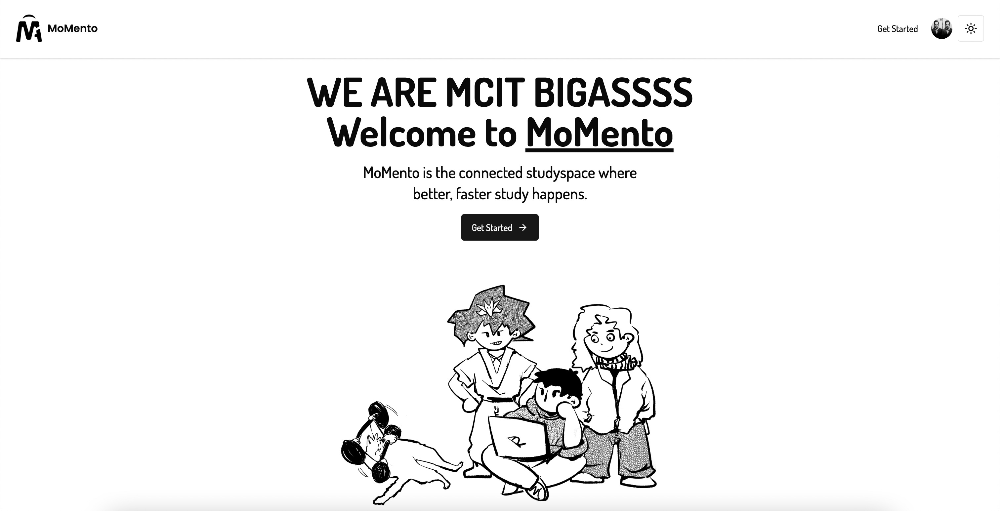
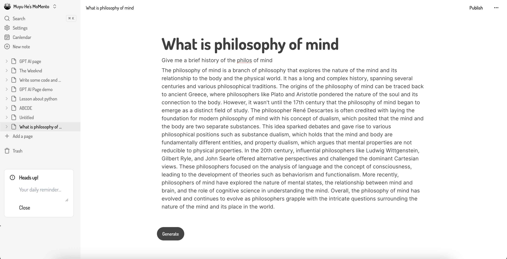

# **Welcome to MoMento!**
___
A simple, fast, intuitive note taking app for MCIT students, built with Next.js, React, Typescript, and Node.js

Live at: https://momento-zeta.vercel.app



-   Can use AI to auto-complete notes and code snippets in seconds
-   Can write and highlight blocks of code
-   Can share files with group members and update content in real-time



___
### Installation

For deployment, need to use **```npm install --force```** due to react-codemirror2's compability issue with React version 18.

After that, run **```npm run dev```** and **```npx convex dev```** to initialize the server and database.

___
**Credits:**

Inspired by [Notion](https://www.notion.so/)

Credit to [Code with Antonio](https://www.codewithantonio.com/)
